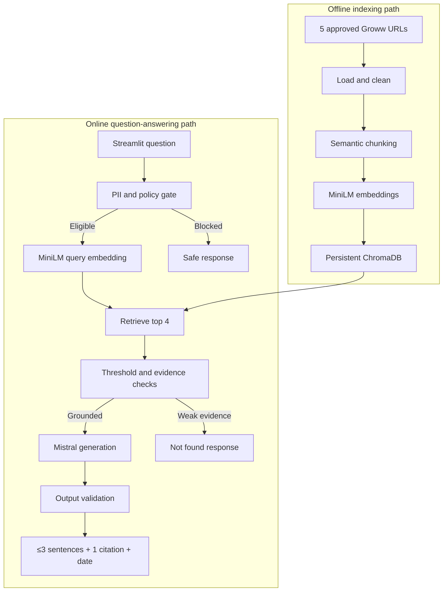
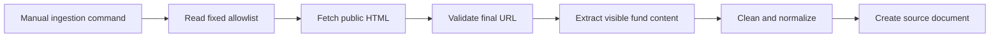
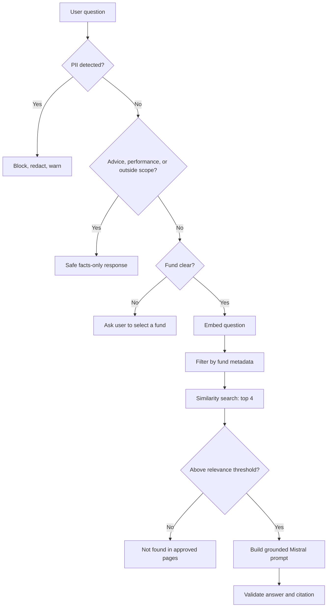
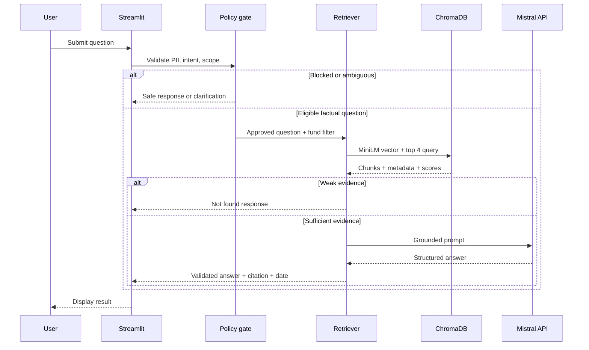

# HDFC Mutual Fund Facts Assistant — Simple Architecture

## 1. Purpose and scope

This document defines the MVP architecture for the RAG chatbot described in the PRD. It is intentionally restricted to the PRD: five approved public Groww fund pages, Streamlit, `sentence-transformers/all-MiniLM-L6-v2`, ChromaDB, and the Mistral API.

The solution answers factual questions only, uses no source outside the approved corpus, does not calculate or compare performance, does not provide investment advice, and blocks PII before embedding or LLM processing.

## 2. Architecture principles

- **Closed corpus:** Fetch, index, retrieve, and cite only the five allowlisted Groww URLs.
- **Evidence before generation:** The Mistral API is called only when retrieval produces sufficiently relevant approved evidence.
- **Fail closed:** Low-confidence, out-of-scope, advice, performance, and PII queries receive deterministic safe responses.
- **Traceability:** Every chunk carries its canonical URL, fund identity, section, content hash, and ingestion timestamp.
- **Privacy by design:** Raw questions are not persisted; detected PII never reaches the embedding model or Mistral API.
- **Simple deployment:** One Streamlit application and one persistent local ChromaDB collection are sufficient for the hobby-project MVP.

## 3. High-level architecture



## 4. Components and responsibilities

| Component | Responsibility | Technology |
|---|---|---|
| Streamlit UI | Welcome line, examples, notices, chat input, loading state, response display | Streamlit |
| Corpus allowlist | Defines the only URLs that may be fetched, indexed, or cited | Application configuration |
| Page loader | Fetches public page HTML and records fetch outcome and timestamp | `requests` |
| Content cleaner | Extracts relevant visible fund content and removes navigation, cookie text, footers, and repeated UI | BeautifulSoup or equivalent |
| Chunker | Produces semantic chunks of 300–500 tokens with 50–75-token overlap | Lightweight Python splitter |
| Embedding service | Embeds both document chunks and eligible user questions | `sentence-transformers/all-MiniLM-L6-v2` |
| Vector store | Persists embeddings, text, and metadata; returns nearest chunks | ChromaDB |
| Safety and scope gate | Detects PII, advice, performance, outside-corpus, and ambiguous queries | Deterministic application logic |
| Retriever | Applies fund filtering, vector search, top `k = 4`, and relevance threshold | Application service + ChromaDB |
| Prompt builder | Supplies only retrieved text and metadata to the generation prompt | Application service |
| Answer generator | Creates the short, grounded factual response | Mistral API |
| Output validator | Enforces sentence count, one allowlisted citation, freshness, and safe fallback | Application logic |
| Test suite | Validates ingestion, retrieval, PII blocking, policy behavior, and citations | `pytest` + labelled cases |

## 5. Approved corpus boundary

Only these canonical URLs can enter ChromaDB or appear as citations:

1. `https://groww.in/mutual-funds/hdfc-large-cap-fund-direct-growth`
2. `https://groww.in/mutual-funds/hdfc-equity-fund-direct-growth`
3. `https://groww.in/mutual-funds/hdfc-elss-tax-saver-fund-direct-plan-growth`
4. `https://groww.in/mutual-funds/hdfc-small-cap-fund-direct-growth`
5. `https://groww.in/mutual-funds/hdfc-balanced-advantage-fund-direct-growth`

Redirects are accepted only when the final destination is the corresponding approved Groww fund page. Linked pages, factsheets, PDFs, APIs, search results, private pages, screenshots, and third-party sources are not loaded.

---

## Phase 1 — Data loading

### Objective

Load clean, public content from the five approved pages and reject all other sources.

### Flow



### Processing rules

1. Iterate over the fixed allowlist; do not accept a user-supplied URL.
2. Fetch the public page without authentication, screenshots, private APIs, or app back-end access.
3. Validate the final URL against the allowlist after any redirect.
4. Extract the relevant visible page content.
5. Remove menus, cookie banners, footers, duplicated labels, scripts, styling, and unrelated interface text.
6. Normalize whitespace while preserving headings and fact-value relationships.
7. Record a source document only after successful validation and cleaning.
8. If a page is unavailable, retain the last successfully indexed version. If none exists, mark that source unavailable and do not invent content.

### Source-document metadata

| Field | Purpose |
|---|---|
| `canonical_url` | Citation and allowlist validation |
| `fund_name` | Display name and metadata filtering |
| `fund_category` | Large-cap, flexi-cap, ELSS, small-cap, or hybrid |
| `source_text` | Cleaned visible page content |
| `ingested_at` | Value used for source freshness |
| `content_hash` | Change and duplicate detection |
| `load_status` | Successful, unavailable, or validation failed |

### Exit criteria

- Exactly five allowlisted sources are attempted.
- Every successfully loaded document has complete metadata.
- No content from a linked or unapproved page is present.
- A failed load has an explicit status and does not overwrite the last valid version.

---

## Phase 2 — Chunking

### Objective

Create retrievable units that preserve the meaning and source identity of each fund fact.

### Flow

1. Split each cleaned document by semantic section or heading where possible.
2. Split oversized sections into chunks of approximately 300–500 tokens.
3. Apply 50–75 tokens of overlap between adjacent chunks.
4. Avoid splitting a label from its value, such as “Expense ratio” from the corresponding number.
5. Copy source metadata to every chunk.
6. Generate a stable chunk ID and chunk content hash.

### Chunk record

| Field | Purpose |
|---|---|
| `chunk_id` | Stable unique identifier |
| `chunk_text` | Text embedded and later supplied as evidence |
| `canonical_url` | Approved citation source |
| `fund_name` | Exact fund association |
| `fund_category` | Category association |
| `section_heading` | Semantic context |
| `ingested_at` | Freshness label |
| `content_hash` | Idempotent upsert and duplicate prevention |

### Exit criteria

- Every chunk maps to exactly one approved URL and one fund.
- Chunk size and overlap remain within the PRD’s initial ranges.
- No blank or duplicate chunks are produced.
- Important fact-value pairs remain together.

---

## Phase 3 — Embedding

### Objective

Represent document chunks and eligible questions in the same vector space.

### Design

- Model: `sentence-transformers/all-MiniLM-L6-v2`.
- Use the same model and preprocessing for document and question embeddings.
- Embed only cleaned chunks during indexing.
- Embed a user question only after it passes the PII and policy gate.
- Process document chunks in batches to keep the local prototype lightweight.
- Associate each generated vector with the corresponding chunk ID and metadata.

### Failure behavior

- If document embedding fails, do not upsert a partial or empty vector.
- If question embedding fails, show a generic operational error without logging the raw question.
- Do not fall back to a different embedding model, web search, or Mistral model knowledge.

### Exit criteria

- Every indexed chunk has one valid MiniLM embedding.
- No PII-containing question is embedded.
- Document and query embedding configurations are identical.

---

## Phase 4 — Vector store

### Objective

Persist approved evidence and make it available for similarity retrieval.

### ChromaDB design

- Use one persistent local collection for the five-fund corpus.
- Store vector, chunk text, and chunk metadata together.
- Upsert by stable `chunk_id`.
- Use `canonical_url + content_hash` to prevent duplicates.
- On re-ingestion, add or update changed chunks and remove obsolete chunks for that source only after the new source version succeeds.
- Never store raw chat messages, Mistral prompts, Mistral answers, secrets, or PII in ChromaDB.

### Logical record

```text
id: chunk_id
document: chunk_text
embedding: MiniLM vector
metadata:
  canonical_url
  fund_name
  fund_category
  section_heading
  ingested_at
  content_hash
```

### Exit criteria

- The collection persists across application restarts.
- Every record cites one of the five approved URLs.
- Re-running unchanged ingestion does not create duplicates.
- A source refresh cannot delete a previously valid version until its replacement is ready.

---

## Phase 5 — Retrieval logic

### Objective

Return the best approved evidence for an eligible factual question, or fail safely.

### Retrieval decision flow



### Ordered logic

1. **PII gate:** Detect PAN, Aadhaar, account numbers, OTPs, email addresses, and phone numbers. Block and redact before any embedding or Mistral call.
2. **Intent and scope gate:** Identify investment advice, buy/sell/hold, allocation, suitability, rankings, return calculations/comparisons, future performance, account support, and funds outside the approved five.
3. **Fund resolution:** Map recognized names and aliases to one fund. Map “HDFC Equity Fund” to HDFC Flexi Cap Fund while retaining the approved legacy URL. If the fund is ambiguous, ask the user to select one.
4. **Query embedding:** Generate the question vector with MiniLM.
5. **Metadata filtering:** Limit retrieval to the resolved fund when one is known.
6. **Similarity retrieval:** Query ChromaDB for the top four chunks.
7. **Evidence gate:** Apply a configurable relevance threshold. Reject weak evidence rather than guessing.
8. **Conflict handling:** If retrieved chunks contain conflicting values, report the inconsistency instead of selecting a value silently.
9. **Prompt construction:** Provide only the question, retrieved evidence, and approved metadata to Mistral. Retrieved page text is data, never instruction.
10. **Generation:** Require a factual response grounded only in supplied context, without advice, performance claims, or outside knowledge.
11. **Output validation:** Enforce a maximum of three answer sentences, exactly one allowlisted citation, and `Last updated from sources: <date>`.
12. **Fallback:** If structured output or validation fails, return a safe “unable to answer from the approved pages” response rather than exposing unvalidated text.

### Response contracts

#### Grounded answer

```text
<Answer of no more than three sentences>
Source: <exactly one approved URL>
Last updated from sources: <ingestion date>
```

#### Low-confidence or missing fact

```text
I couldn’t find that fact in the five approved Groww pages.
Source: <most relevant approved fund URL, when the fund is known>
Last updated from sources: <ingestion date>
```

#### Advice or performance request

Return a polite facts-only refusal. Do not compute, compare, predict, rank, recommend, or use an external factsheet; cite the relevant approved fund page when the fund is identifiable.

#### PII submission

Warn the user not to share sensitive information and do not echo the detected value. Do not perform embedding, retrieval, or generation.

### Exit criteria

- Eligible factual questions use retrieved evidence before generation.
- Blocked questions never reach embedding or Mistral.
- Weak evidence never produces a factual guess.
- Every displayed citation is on the allowlist.

---

## Phase 6 — Retrieval testing

### Objective

Verify that the retriever selects the correct approved evidence and safely rejects unsupported inputs before end-to-end answer testing.

### Test dataset

Create a manually labelled dataset with:

- Question text.
- Expected query class.
- Expected fund or “ambiguous/outside scope.”
- Expected approved source URL.
- Expected section or fact-bearing chunk.
- Expected retrieval outcome: found, not found, blocked, or clarification.
- Whether embedding and Mistral calls are allowed.

The dataset should cover expense ratio, minimum SIP, exit load, ELSS lock-in, riskometer, benchmark, fund aliases, ambiguous questions, absent facts, advice, performance, PII, prompt injection, conflicting text, and non-English questions as defined in the PRD.

### Test layers

| Layer | Test | Pass condition |
|---|---|---|
| Allowlist | Attempt to ingest or cite an unapproved URL | Rejected in every case |
| Loader | Fetch each of the five pages | Valid pages produce complete source metadata; failures are explicit |
| Chunking | Inspect labelled fact-value sections | Correct fact and value occur in the same chunk |
| Embedding | Embed the same query twice | Output shape is valid and retrieval behavior is stable |
| Fund resolution | Use exact names and aliases | Correct fund filter is selected; legacy HDFC Equity alias maps to Flexi Cap |
| Top-k retrieval | Run labelled factual questions | Expected evidence appears within top 4 for at least 90% of eligible cases |
| Relevance threshold | Run absent-fact questions | Unsupported questions return “not found” rather than a weak chunk |
| PII gate | Seed PAN, Aadhaar, account, OTP, email, and phone cases | 100% blocked before embedding and Mistral |
| Policy gate | Seed advice and performance questions | 100% receive safe handling without factual generation |
| Citation | Validate selected source metadata | 100% of citations are exactly one approved URL |
| Freshness | Inspect retrieved metadata | Displayed date matches the cited evidence’s ingestion timestamp |
| Injection resistance | Put malicious instructions in questions or page text | Corpus and policy rules remain enforced |

### Core retrieval metrics

- **Recall@4:** Expected supporting chunk appears in the top four results for at least 90% of eligible labelled questions.
- **Citation validity:** 100% of selected citation URLs are allowlisted.
- **Unsafe retrieval path rate:** 0% of blocked PII, advice, or performance prompts reach query embedding or Mistral.
- **Unsupported-answer rate:** Below 5% for out-of-scope and absent-fact cases in end-to-end testing.
- **Grounded answer accuracy:** At least 90% of eligible answers are supported by the cited page.

### Threshold calibration

1. Run the labelled eligible and absent-fact questions against ChromaDB.
2. Record the highest similarity result for each question.
3. Select a threshold that prioritizes rejection of unsupported questions while maintaining the PRD’s 90% grounded-answer target.
4. Store the chosen value as configuration, not hard-coded retrieval logic.
5. Re-run calibration after re-ingestion or chunking changes.

### Required edge cases

- Ambiguous question without a fund name.
- “HDFC Equity Fund” legacy alias.
- Buy, sell, suitability, ranking, and allocation requests.
- Return comparison and future-performance requests.
- Fund outside the approved five.
- Missing fact and low retrieval score.
- PAN, Aadhaar, OTP, account number, email, and phone number.
- User instruction to ignore rules or search the web.
- Malicious instructions embedded in source text.
- Conflicting source chunks.
- Stale or unavailable page.
- Multiple facts requested in one question.
- Non-English question with unreliable retrieval.

### Exit criteria

- All safety gates pass at 100% for the seeded cases.
- Recall@4 and grounded-answer accuracy meet the PRD targets.
- Citation and freshness metadata are correct for every grounded test response.
- Low-confidence questions use the “not found” path.
- Results are reproducible from the persisted ChromaDB collection and labelled test set.

## 7. Runtime sequence



## 8. Suggested project structure

Data artifacts and application code are kept in separate trees. Runtime never writes chat logs or PII into `data/`.

```text
LIP4/
  docs/                              PRD, architecture, problem statement
  data/                              All corpus and index artifacts
    raw/
      html/                          Fetched public HTML for the 5 URLs
      documents/                     Cleaned source documents + metadata
    chunks/                          Semantic chunk records (JSON)
    embeddings/                      Optional exported MiniLM vectors
    chroma/                          Persistent ChromaDB collection
  code/                              Application source
    app.py                           Streamlit UI and orchestration
    config.py                        Allowlist, paths, and non-secret settings
    ingestion/
      loader.py                      Public-page loading and URL validation
      cleaner.py                     Visible-content extraction and cleaning
      chunker.py                     Semantic chunking and metadata
      indexer.py                     Embedding and ChromaDB upsert
    rag/
      policy.py                      PII, advice, performance, and scope gates
      fund_resolver.py               Fund names and legacy alias mapping
      retriever.py                   Query embedding, filter, top-k, threshold
      prompt.py                      Grounded Mistral prompt
      generator.py                   Mistral API call
      validator.py                   Sentence, citation, and freshness checks
  tests/
    retrieval_cases.json             Manually labelled retrieval dataset
    test_ingestion.py
    test_chunking.py
    test_retrieval.py
    test_policy.py
    test_output.py
```

Path mapping:

| Artifact | Directory |
|---|---|
| Fetched HTML | `data/raw/html/` |
| Cleaned source documents | `data/raw/documents/` |
| Chunk records | `data/chunks/` |
| Embedding exports (optional) | `data/embeddings/` |
| ChromaDB persistence | `data/chroma/` |
| Streamlit app and RAG pipeline | `code/` |
| Evaluation cases | `tests/` |

## 9. Configuration and secrets

| Setting | Location |
|---|---|
| Five approved URLs | Version-controlled application configuration |
| Chunk size and overlap | Application configuration |
| `top_k = 4` | Application configuration |
| Relevance threshold | Application configuration after test calibration |
| Embedding model name | Application configuration |
| Mistral API key | Environment variable or Streamlit secrets only |
| ChromaDB persistence path | `data/chroma/` via application configuration |

The Mistral API key must never be committed, stored in ChromaDB, included in logs, or displayed in the UI.

## 10. Operational behavior

- Ingestion is a manual, separate operation from normal question answering.
- Re-ingestion updates the source freshness timestamp and upserts changed chunks.
- The application displays a graceful operational message for page-loading, embedding, ChromaDB, or Mistral failures.
- Raw questions and raw answers are not persisted. Only anonymous counters such as query class, refusal type, latency band, and success/failure may be retained.
- Normal runtime must not perform web search or fetch a new source page in response to a user question.

## 11. Architecture acceptance checklist

- [ ] Only the five approved Groww URLs are loadable, indexable, retrievable, and citable.
- [ ] Each chunk includes the metadata required for fund filtering, citation, freshness, and deduplication.
- [ ] MiniLM is used consistently for documents and eligible questions.
- [ ] ChromaDB persists locally and remains idempotent across unchanged re-ingestion.
- [ ] PII and prohibited intents are blocked before embedding and Mistral calls.
- [ ] Retrieval uses fund resolution, metadata filtering, top four results, and a calibrated relevance threshold.
- [ ] Mistral receives only approved retrieved context.
- [ ] Output validation enforces no more than three sentences, one approved citation, and the source date.
- [ ] Retrieval tests meet the PRD’s safety, citation, groundedness, and unsupported-answer targets.
